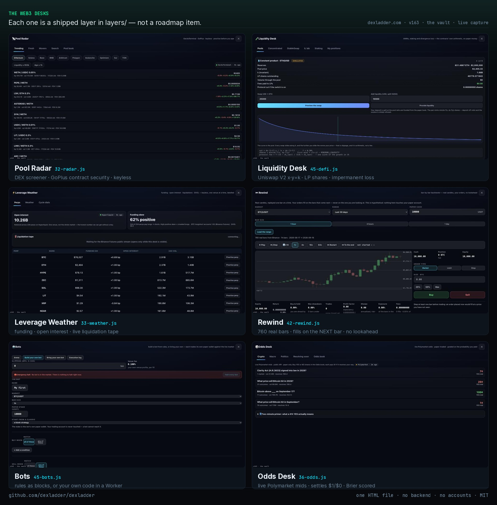
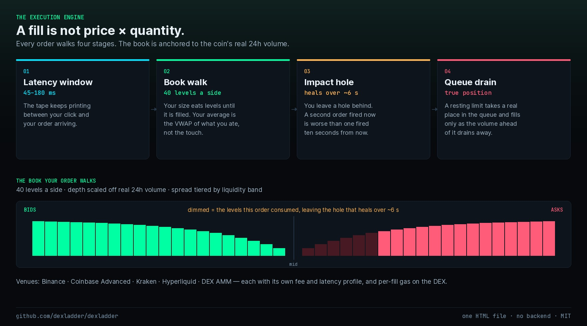
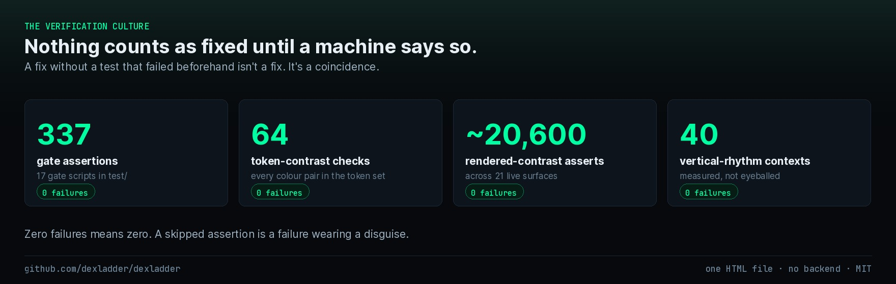
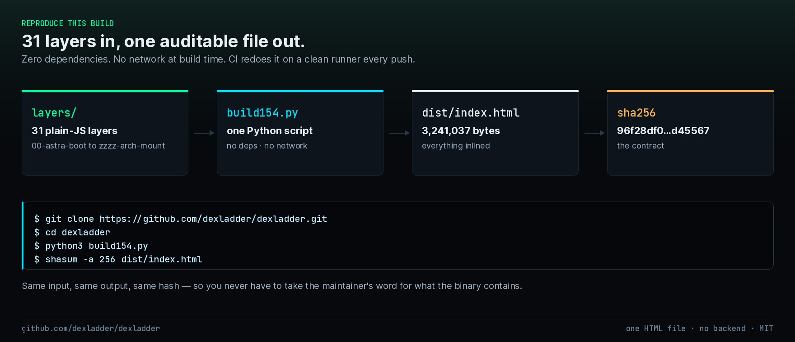

# DexLadder


<!-- badges -->
[](https://github.com/dexladder/dexladder/actions/workflows/verify.yml)
[](LICENSE)
[](#reproduce-this-build)
[](https://github.com/dexladder/dexladder/releases/latest)
[](#)
[](https://dexladder.com)
[](https://github.com/dexladder/dexladder/stargazers)

**[Open the live app](https://dexladder.com)** · **[Download the single file](https://github.com/dexladder/dexladder/releases/latest)** · **[Verify the build](docs/VERIFY.md)** · **[Discussions](https://github.com/dexladder/dexladder/discussions)**
<!-- /badges -->
<p align="center">
  
</p>

**The gateway to Web 3.0.**

The whole on-chain market — every pool, every chain, every venue — opened in
your browser from a single HTML file. Read any DEX pool with contract security
attached, run the real AMM arithmetic, watch liquidations stream live, fork a
chain and trade your own contracts, and put your own bot in front of it.

Nothing here asks for a wallet connection, a seed phrase, an account, or a
deposit. That is the point: Web3 is worth understanding before it is worth
risking, so every ticket on the desk settles in test funds while every number
on the screen is real and live. No telemetry, no analytics, no tracker — your
positions and your history never leave the browser.

---

## Try it in 10 seconds

**→ [dexladder.com](https://dexladder.com)** — the live app. No signup, no wallet, no email. It opens straight into the markets screen.

Or take it with you:

```
1. Download the single HTML file from Releases (or build it — see below).
2. Double-click it.
3. That's the whole install.
```

One file. **3,241,037 bytes.** No bundler output, no module loader, no npm dependency, no build step required to *run* it, and no DexLadder server anywhere — there is no backend to call home to. It works offline — on a plane, in a lecture hall, on a laptop that has never met this repo. Your entire state is one `localStorage` blob you can export as a signed bundle and carry to another machine.

---

## The promise

Most crypto apps are a funnel. This one has nowhere to funnel you to.

- **No accounts.** There is no login screen, because there is no user table.
- **No server.** There is no backend that holds your data, because there is no backend.
- **No ads, no affiliate links, no referral codes, no token, no upsell.**
- **No real money, ever.** You cannot deposit. There is no deposit.
- **Your data never leaves your device.** Portfolio, lesson progress and trade history live in your browser and are sent nowhere.
- **No telemetry, no analytics, no tracker, no fingerprinting.** Nothing measures you.

> One honest caveat, stated plainly rather than buried: live prices come from public market APIs (CoinGecko, Binance, OKX, CryptoCompare, Coinpaprika, Blockstream and a few others), so those providers see your IP the same way any website you open does. The optional TradingView chart and the embedded video lessons load from their own hosts when — and only when — you open them. Turn the network off and the desks, the academy and your portfolio all keep working.

> Every crypto app wants your money. This one won't take it.

Don't trust — verify. (Instructions for exactly that are below.)

---

## What's actually in it

A **sovereign Web3 terminal**: DEX pool screening with contract security, AMM
and liquidity mechanics, perpetuals with a live liquidation tape, a bar-by-bar
backtester, a runtime that executes *your* bot code, prediction markets, and a
local chain fork you can point at your own contracts — with the course built in
and test funds in every ticket, so the only thing you can lose is a
misconception.

### The execution engine

Fills are not "price × quantity." Every order goes through a deterministic engine anchored to the coin's real 24h volume:

| Mechanic | What it does |
| --- | --- |
| Order book | 40 levels a side, with spreads tiered by the asset's real liquidity |
| Impact & recovery | Your size moves the book; liquidity heals back over ~6 seconds |
| Latency | A 45–180 ms window between your click and your fill |
| Queue position | Resting limit orders hold a true place in the queue, which drains as the tape prints |
| Venues | Binance, Coinbase Advanced, Kraken, Hyperliquid and a DEX AMM — each with its own fee and latency profile, including per-fill gas on the DEX |

On top of that sit perpetuals with funding and liquidation, Black-Scholes options with correctly scaled greeks, DCA and grid bots, and a replay engine with four historical eras and injectable black swan events. A quant desk runs Monte Carlo on your portfolio. A FIFO/LIFO tax estimator produces numbers *and* publishes its own nine limitations, because an estimator that hides its assumptions is a liability.

<p align="center">
  
</p>

### The Web3 desks

This is the half nothing else in the category has, and each one is a shipped
layer in `layers/`, not a roadmap item.

| Desk | What it actually does |
| --- | --- |
| **Pool Radar** (`32-radar.js`) | DEX screener over GeckoTerminal networks — Trending, Fresh, Movers, Search; 5m/1h/6h/24h columns, buys/sells, liquidity, FDV, age to the second; GoPlus contract security on EVM and Solana; pool candles drawn by DexLadder's own canvas. Then **“Practise this pool”** — a constant-product AMM sandbox with a 1,000-USDT paper pool book, real liquidity-based slippage and LP fee. |
| **Spot Rail** (`42-cmc.js`) | CoinMarketCap's keyless on-chain feed as a **second independent witness** to GeckoTerminal for the same pool — then it puts the two prices side by side and says out loud when they disagree. A DEX price is an observation, not a fact. |
| **Liquidity Desk** (`45-defi.js`) | Protocol-faithful DeFi bench. Uniswap V2 constant product `x·y=k` with the fee taken off the *input*, LP shares minted properly, staking protocols, and impermanent loss — the loss that only shows up when you leave. Nothing here is a metaphor; every number comes out of the arithmetic the real contracts run. |
| **Local network forking** (`43-fork.js`) | Point the terminal at a chain you own — `anvil --fork-url …` or a Hardhat node — and trade **your own contracts** inside the same ticket, with the same order types, the same price-impact model and the same ledger. |
| **Leverage Weather** (`33-weather.js`) | Real funding, open interest, long/short, and a **live liquidation tape** streaming over Binance's public WebSocket. Source ladder: Hyperliquid `/info` → OKX v5 → Binance Futures. DVOL from Deribit. |
| **Rewind** (`42-rewind.js`) | Bar-by-bar backtester on real candles (Binance → Coinbase → Kraken). Orders fill on the bars that come **next** — market at the open, limits and stops only when a bar trades through them — so a run can never flatter itself with a price the trader had not seen. Equity curve, drawdown, exposure, profit factor, Sharpe. |
| **Bots** (`45-bots.js`) | **Build your own** — rules as blocks, tested bar by bar on real history, then run live. **Bring your own** — your JavaScript in a Worker the layer spawns, *or* your own process in any language answering one GET with one JSON object. Each bot trades a wallet of its own. |
| **Odds Desk** (`36-odds.js`) | Live Polymarket odds you can paper-trade. Keyless public reads (Gamma events/markets + CLOB midpoints), a separate 1,000-USDT book, YES/NO shares at the live mid plus a printed spread and slippage model, settlement to $1/$0, and a **Brier score** on the probability you paid. |
| **Chain Ladder & Venue Board** (`39-desks.js`) | TVL, DEX volume, fees and stablecoin cap per chain from DefiLlama; CEX trust score, volume, country and year alongside DEX volumes — with *fill quality for your size*. |
| **Sentinel** (`38-sentinel.js`) | Alerts you say in words, compiled into rules you can read: move-in-window, volume spike, funding flip or level, stablecoin depeg, RSI cross, Weather level, Rung breadth. The compiler is deterministic — the model can front it, but is never needed for it. |
| **Supply Drift & Era Ledger** (`39b-ledgers.js`) | No free token-unlock API exists, so the app records circulating supply **on your device** daily and shows measured 7d/30d dilution, plus weekly top-100 snapshots you can scrub back through. Honest about its own start date. |
| **Tax ledger** (`docs/`) | Multi-jurisdiction crypto tax engine — IRS, India, Germany, UAE — with 69 Python cases and 35 JS oracles passing. |

### The academy

Twelve lessons, roughly twenty interactive labs — you run the mechanic, you don't read about it — ending in a signed proof-of-work certificate that records what you actually completed.

### Everything else

A 500-coin markets screen. A 15-chain explorer with a cross-chain mempool radar. A news desk over six RSS sources with a weighted impact score. An on-device simulated P2P bazaar, plus real WebRTC peer-to-peer transfer between two browsers. And an AI layer with one hard law: **numbers may only come from typed tool envelopes.** The model writes the prose around the slots; a bare numeral appearing outside a slot is rejected before it reaches the screen. A language model does not get to invent a price here.

---

## The verification culture

<p align="center">
  
</p>

This is the part worth caring about.

Every claim this app makes about itself is machine-verified, and every reported bug must be **reproduced and pinned with a permanent assertion** before anyone is allowed to call it fixed. A fix without a test that failed beforehand isn't a fix; it's a coincidence.

The current build:

| Check | Count | Failures |
| --- | --- | --- |
| Gate assertions | 337 | 0 |
| Token-contrast checks | 64 | 0 |
| Rendered-contrast assertions | ~20,600 over 21 surfaces | 0 |
| Vertical-rhythm contexts | 40 | 0 |

The build is byte-for-byte reproducible from source. Same input, same output, same hash — anyone can confirm the file they downloaded is the file this repo describes.

The current release, `v159`:

```
dist/index.html   3,241,037 bytes
sha256            96f28df0eb485f8718f1ed1ab9568157e0e3b1cc150eb6b02573074569d45567
```

That is the tagged release artifact. Download it, hash it, build it here, hash that — those three should agree.

dexladder.com runs continuously from the same tree and is usually ahead of the last tag, so the file the site serves will not always match the hash above. Verify against the release you downloaded, not against the live page.

Recent work that came out of that discipline:

- **A canonical market snapshot.** Four different total market caps could render on one screen at one instant. They can't now — every surface reads the same snapshot.
- **A source quorum.** When two price sources disagree, the app says so, instead of quietly displaying their median as fact.
- **Read-time freshness.** Freshness labels are derived when data is read, so no surface can show stale numbers wearing a "live" badge.

---

## Verify it yourself

Don't take the table above on faith. Reproduce it:

```bash
git clone https://github.com/dexladder/dexladder.git
cd dexladder
npm ci --prefix test

node test/gate154.js dist/index.html        # runs the full assertion suite
python3 build154.py       # produces the single-file build
shasum -a 256 dist/index.html
```

The gate prints every assertion it evaluates and exits non-zero if a single one fails. If your hash matches the published one, your file is the file. Full walkthrough — including what to read first in the source — in **[docs/VERIFY.md](docs/VERIFY.md)**.

## Build from source

```bash
npm ci --prefix test
python3 build154.py
```

The output is one self-contained HTML file with everything inlined. Open it with a browser; there is no dev server to start, no bundler config to understand, and no `node_modules` needed at runtime.

---

## What this is not

- **It is not financial advice.** Nothing here is a recommendation to buy, sell, or hold anything.
- **It is not a real exchange.** You cannot deposit, withdraw, or trade real assets. All positions are simulated.
- **It does not predict anything.** The desks model market *mechanics*, not market direction. Performing well here is not evidence you will perform well anywhere else.
- **The tax estimator is an estimator.** It lists its own nine limitations for a reason. It is not a filing.
- **It is not a claim of novelty.** Queue-aware replay and competitive scoring both have prior art. This is a careful implementation, not a first.

---

## Contributing

Bug reports are welcome and must be reproducible. Fixes must ship with a permanent gate assertion that fails before the change and passes after. See **[CONTRIBUTING.md](CONTRIBUTING.md)**.

Security reports: **[SECURITY.md](SECURITY.md)**.

## Licence

**MIT.** Fork it, teach with it, embed it, sell something built on it — keep the
copyright notice. See [LICENSE](LICENSE).

---

*No account. No backend. Your data stays in your browser.*


---

## Reproduce this build

<p align="center">
  
</p>

Don't trust the binary in Releases — rebuild it and compare the hash. CI does
exactly this on every push, on a clean Ubuntu runner, and goes red if the bytes
drift:

```bash
git clone https://github.com/dexladder/dexladder.git
cd dexladder
python3 build154.py                 # no dependencies, no network
shasum -a 256 dist/index.html
```

| field | value |
| --- | --- |
| bytes | `3,241,037` |
| sha256 | `96f28df0eb485f8718f1ed1ab9568157e0e3b1cc150eb6b02573074569d45567` |
| build input | `build154.py` + `layers/` + `src/` |
| runtime dependencies | none |
| network calls at build time | none |

Full method in [`docs/VERIFY.md`](docs/VERIFY.md).

---

## Contribute

The code is one build script, a `layers/` directory of plain JavaScript, and a
Playwright gate suite. There is no framework to learn and no toolchain to
install beyond Python 3 and Node.

- **[Good first issues](https://github.com/dexladder/dexladder/labels/good%20first%20issue)** — small, self-contained, reviewed quickly.
- **[Write a lesson](https://github.com/dexladder/dexladder/issues/new?template=lesson_request.yml)** — the academy is prose plus a desk hook. No JS required to propose one.
- **[CONTRIBUTING.md](CONTRIBUTING.md)** — the rules, the gates, and what will be refused.

Hard lines that will not move: no accounts, no backend, no real money, no
ads, no token, no tracker, no analytics. A new third-party runtime script
needs a very good reason — the only one today is the optional TradingView
chart, which is lazy-loaded and has a dependency-free native engine behind it.

---

<div align="center">

**If this is useful to you, star it.** That is the entire growth strategy —
there is nothing to buy and nobody to sell you to.

</div>
